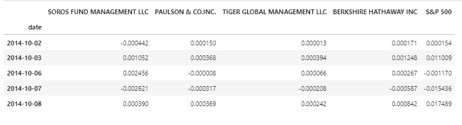
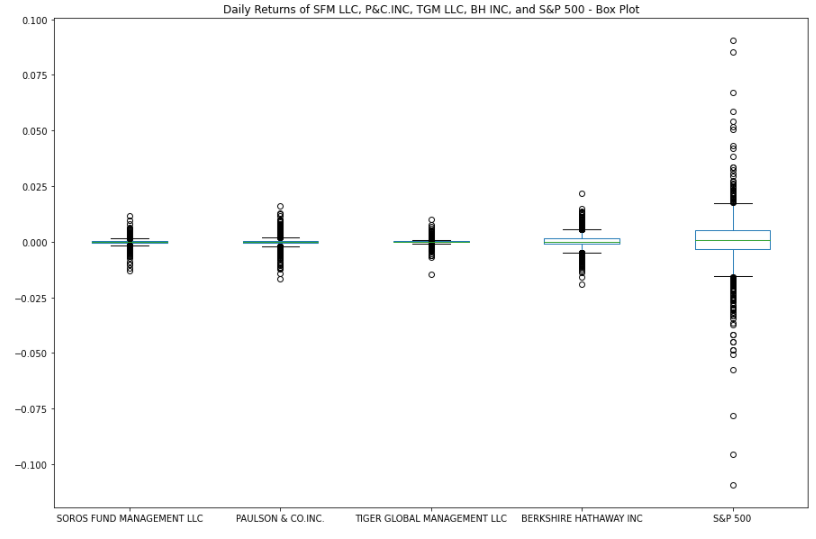
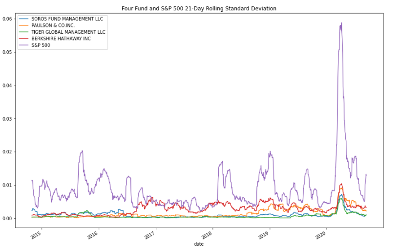
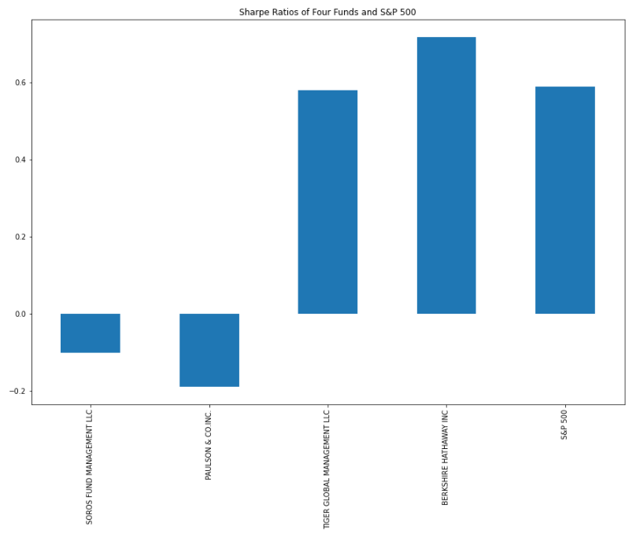
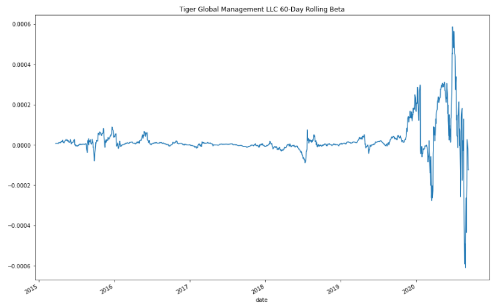

# Challenge4

# Risk Return Analysis

This is a python command-line interface application that aims to offer clients a one-stop online investment solution for their retirement portfolios that’s both inexpensive and high quality. The application works by taking in DataFrame from 'whale_navs.csv' and evaluating four new investment options for inclusion in the client portfolios. The platform determines the fund with the most investment potential based on key risk-management metrics: the daily returns, standard deviations, Sharpe ratios, and betas. It then makes a recommendation on a fund that works best with client's investment objectives.

---

## Technologies

This project leverages Python 3.7 with the following packages and dependencies:

* [pandas](https://pandas.pydata.org/) - An open-source data analysis and manipulation tool.

* [pathlib](https://docs.python.org/3/library/pathlib.html) - Used to identify a file using absolute or relative path. 

* [%matplotlib inline](https://pandas.pydata.org/pandas-docs/stable/user_guide/visualization.html) - Tells Jupyter to create the plot inline with the code in the notebook.

* [numpy](https://numpy.org/) - Used for numerical computing tools
---

## Installation Guide

Python 3.7, GitBash, and JupyterLab are required to be installed before running the application.

---

## Usage

To use the Risk Return Analysis application simply clone the repository and run the **risk_return_analysis.ipynb** with:

```python
python risk_return_analysis.ipynb
```

Attached screenshots below show the different plots











---

## Contributors

Brought to you by Trilogy and Christine Guo (www.linkedin.com/in/christine-guo)

---

## License

NoNe